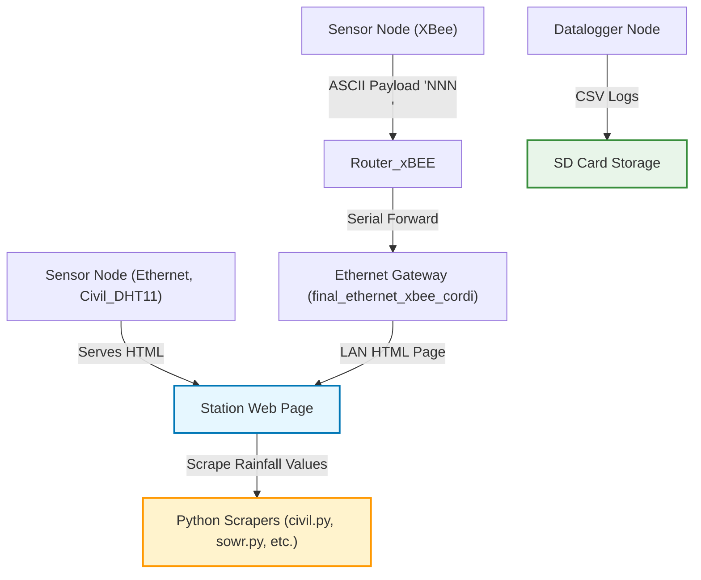

# Arduino-based Wireless Sensor Network for Rainfall–Runoff Measurement (IIT-Kharagpur, India) 
#### Contents: Source code for a Wireless Sensor Network for rainfall-runoff measurement, remote data logging, and interactive web-server. Masters Thesis work by Subhrasankha Dey (2014-2017).
#### Project: Real-time, low-cost hydro-meteorological monitoring network at IIT Kharagpur, India. 
#### Purpose: Collect rainfall and related meteorological/hydraulic data using Arduino field nodes, host a small station web UI per node, locally log data to SD (with RTC), and forward/aggregate remote node measurements using XBee → Ethernet gateways.
#### Funded by: Department of Science and Techonology, Govt. of India.  
#### Publication - Real-time OGC compliant online data monitoring and acquisition network for management of hydro-meteorological hazards (https://doi.org/10.1080/09715010.2016.1264896)

---

## Quick links

- [Repository root (tree view)](https://github.com/aceacedey/Arduino_Wireless_Sensor_Rainfall-Runoff_Measurement_DST_IIT-KGP/tree/main)  
- Key folders:
  - [Arduino sketches](https://github.com/aceacedey/Arduino_Wireless_Sensor_Rainfall-Runoff_Measurement_DST_IIT-KGP/tree/main/DST_Project_Codes/Arduino_code_IITKGP_WSN)
  - [Python helpers & scrapers](https://github.com/aceacedey/Arduino_Wireless_Sensor_Rainfall-Runoff_Measurement_DST_IIT-KGP/tree/main/DST_Project_Codes/Python_code_XBEE_Wireless_Transmit_Receive)
  - [Router XBee code](https://github.com/aceacedey/Arduino_Wireless_Sensor_Rainfall-Runoff_Measurement_DST_IIT-KGP/tree/main/DST_Project_Codes/Python_code_XBEE_Wireless_Transmit_Receive/Router_xBEE)
  - [Web UI (map + realtime pages)](https://github.com/aceacedey/Arduino_Wireless_Sensor_Rainfall-Runoff_Measurement_DST_IIT-KGP/tree/main/DST_Project_Codes/HTML_code_IITKGP_WSN)

---

## One-line summary
This repository contains Arduino sketches, a small XBee → Ethernet router/gateway, and Python scraper/logger scripts used to run a pragmatic hydro-meteorological sensor network. Nodes either (a) host an HTML status page on a fixed IP (Ethernet shield) or (b) log locally to SD; remote nodes send ASCII payloads over XBee to a router/gateway which makes values available on the LAN; Python scrapers fetch the pages and append daily logs.

---

## Files & roles

### `DST_Project_Codes/HTML_code_IITKGP_WSN/index.html`
- **Role:** Map and station launcher page.  
- Contains Google Maps markers linking to station web UIs (LAN IPs such as `http://10.171.9.208/`). Used for human navigation to each station interface as shown in the figure below.


---

### `DST_Project_Codes/Arduino_code_IITKGP_WSN/Civil_DHT11_ethernet_allsensors_01_06_15.ino`
- **Role:** Station web-server sketch for a Civil Engineering station.  
- **Key behaviors:**
  - Static IP `10.19.2.42`, serves auto-refreshing HTML (`Refresh: 15`).  
  - Reads DHT11 (humidity/temperature).  
  - Reads analog wind direction (ADC mapped to compass sectors), wind speed (pulse counting), tipping-bucket rainfall (`0.254` mm per tick), and ACS712 turbine current.  
  - Serves timestamp, humidity, temperature (°C/°F/K), wind direction, wind speed (km/h), turbine current (mA), instantaneous rainfall, 15-minute rainfall, and daily rainfall.  
- **Use:** Flash to Arduino + Ethernet shield + sensors → station page accessible on LAN.

---

### `DST_Project_Codes/Arduino_code_IITKGP_WSN/Datalogger_step_09-08-2016.ino`
- **Role:** SD-card datalogger sketch.  
- **Key behaviors:**
  - Uses `SD.h` and `RTC_Millis`.  
  - Generates a filename based on RTC and appends a CSV line every minute with timestamp + `analogRead(A2)` sensor reading.  
- **Use:** Node-side local backup and offline logging.

---

### `DST_Project_Codes/Python_code_XBEE_Wireless_Transmit_Receive/Step_reciever_22-06-2015/final_ethernet_xbee_cordi`
- **Role:** Gateway Arduino sketch (Ethernet + Serial).  
- **Key behaviors:**
  - Static IP (example `10.124.4.8`), runs `EthernetServer` on port 80.  
  - Reads ASCII digits from Serial (attached XBee), converts to integer, applies calibration, and serves the computed value via HTML.  
- **Use:** Transparent RF → LAN gateway — attach XBee to Arduino Serial, publish readings on LAN.

---

### `DST_Project_Codes/Python_code_XBEE_Wireless_Transmit_Receive/civil.py`, `sowr.py`, `STEP.py`, `VSRC.py`
- **Role:** Python scrapers / local loggers (client-side).  
- **Key behaviors:**
  - Fetch station HTML pages (e.g., `http://10.19.2.42`, `http://10.172.3.202`) using `urllib.request`.  
  - Parse HTML with `BeautifulSoup`, locate labeled rainfall lines, and read the numeric value on the next line.  
  - Use a 300 s (~5 min) windowing logic to decide when to append values to daily logs.  
  - Create per-station per-month directories and write daily files under a specified `startpath` (original code used an Apache htdocs path on Windows).  
- **Use:** Run on a LAN machine to archive station readings automatically.

---

### `DST_Project_Codes/Python_code_XBEE_Wireless_Transmit_Receive/Router_xBEE/`
- **Role:** XBee router / serial parser (Arduino).  
- **Key behaviors (from provided code):**
  - Reads Serial until newline `\n`.  
  - Stores incoming ASCII bytes into `data[]`.  
  - Decodes the first three ASCII digits into an integer:

    ```c
    p = (data[2] - 48) + 10 * (data[1] - 48) + 100 * (data[0] - 48);
    sensorReading = p;
    ```

  - Prints `sensorReading` to Serial every second.  
- **Use:** Flash to an Arduino with XBee module to decode 3-digit numeric payloads (`NNN\n`) from remote sensors; provides numeric values for forwarding or logging.

---

## Operational flow

1. **Field node (Ethernet)** — reads sensors and serves HTML (example: `Civil_DHT11_...` at `10.19.2.42`).  
2. **Remote node (XBee)** — transmits ASCII payloads (`NNN\n`) to a receiver.  
3. **Router (`Router_xBEE`)** — decodes ASCII into numeric readings and prints to Serial.  
4. **Gateway (`final_ethernet_xbee_cordi`)** — reads serial-frame values, applies calibration, and serves via HTTP on the LAN.  
5. **Client logging** — Python scrapers fetch station pages and append per-day rainfall logs.  
6. **Local backup** — Datalogger writes CSVs to SD card for offline recovery.

---

## Diagram

## Deployment checklist

### Civil station (Ethernet)
- Wire sensors per the sketch (DHT11 to D6, ACS712 to A5, rain/wind sensors to specified analog pins).  
- Set the static IP in `Civil_DHT11_...ino` (`byte ip[] = {10,19,2,42};`) if required.  
- Compile & flash the sketch to the Arduino with an Ethernet shield.  
- Verify the station page at `http://<ip>/`.  

### Datalogger node
- Wire sensor to `A2` (or update code).  
- Insert SD card and set `chipSelect = 4`.  
- Flash `Datalogger_step_09-08-2016.ino`.  
- Confirm CSV files are created and appended.  

### XBee router
- Flash the `Router_xBEE` Arduino sketch to an Arduino connected to an XBee receiver.  
- Verify incoming payloads are decoded and printed to Serial.  

### XBee gateway
- Flash `final_ethernet_xbee_cordi` to a gateway Arduino (Ethernet + Serial to XBee).  
- Set the gateway IP (e.g., `10.124.4.8`).  
- Confirm the HTTP page shows forwarded/calibrated values.  

### Python scrapers
- Install dependencies:  
  ```bash
  pip install beautifulsoup4
  ```
### Python scrapers
- Run `civil.py`, `sowr.py`, etc., on a LAN machine that can reach the station IPs.  
- Update the `startpath` variable in each script to point to your desired local archive directory.  

---

### Server / publishing (optional)
- Ingest scraped logs or forwarded HTTP data into a central database.  
- Run any **GML/CSW/WFS** publishing pipeline if required.  

---

## Notes & cautions
- HTML pages auto-refresh every **15 s** → scrapers should use reasonable polling intervals to avoid overloading nodes.  
- Rainfall conversion factor in sketches: **0.254 mm per tipping-bucket tick** — verify calibration with your gauge.  
- The router parser expects **3 ASCII digits + newline** (`NNN\n`). Modify the parser if payload formats differ.  
- Python scrapers rely on exact text labels (e.g., `"RAINFALL in past 5 mintutes"`). Update scrapers if station HTML changes.  
- The datalogger sketch logs every **60 s** → adjust sampling to match power and storage constraints.  
- Always close SD file writes to avoid corruption during power loss.  

---

# Distributed Computing Project
## Chord DHT Implementation in C/C++ (Coursework - Distributed Computing)
This project is an implementation of a Chord Distributed Hash Table (DHT). The system is designed to simulate a distributed key-value store by spawning multiple processes on a single Unix/Linux-based machine, where each process acts as a node in the DHT ring.
The project consists of a C++ backend that manages the DHT logic and a simple C-based command-line interface (CLI) for user interaction.

---

# CMOS_Camera_Codes
Contains the source code of integrating OV7670 CMOS camera with Arduino and make it compatible with Quadcopters.

---

# Quadcopter_Codes
Contains dev codes for a custom made quadcopter. Video - https://www.youtube.com/watch?v=NtLcCc_VHIg
